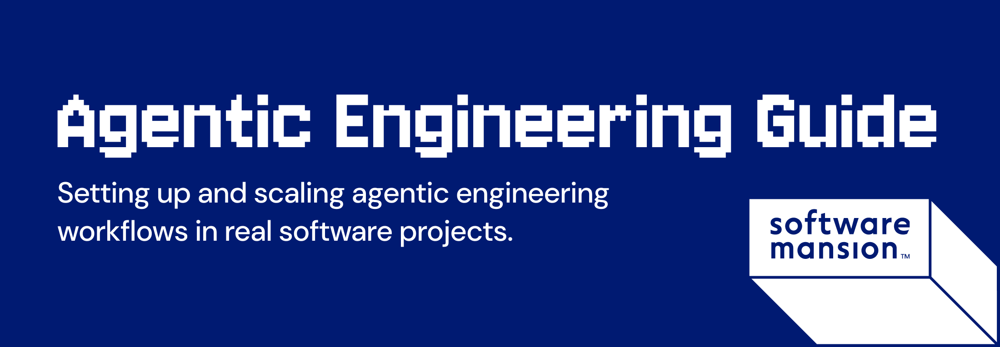

# 

This book collects practical insights from applying agentic engineering patterns in [Software Mansion's](https://swmansion.com?utm_source=agentic-engineering&utm_medium=readme) own projects and in our clients' work. We’re sharing it publicly so more teams can build with these methods.

You can read the book online at https://agentic-engineering.swmansion.com/.

## Development

This is a standard [Astro Starlight](https://starlight.astro.build/) project. We use [Bun](https://bun.com/) as a package manager.

```bash
bun install

# Runs locally at `http://localhost:4321`.
bun run dev

# Formats code with Prettier and runs `astro check`.
bun run lint

# Build
bun run build
bun run preview
```

## 🤝 Contributing

We welcome contributions! Please feel free to submit a Pull Request.

## License

This project is dual-licensed. See [LICENSE.md](./LICENSE.md) for scope and details.
Full license texts: [CC BY-NC-SA 4.0](./LICENSE-CC-BY-NC-SA) and [MIT](./LICENSE-MIT).

## Agentic Engineering Guide is created by Software Mansion

[](https://swmansion.com)

Since 2012 [Software Mansion](https://swmansion.com) is a software agency with
experience in building web and mobile apps. We are Core React Native
Contributors and experts in dealing with all kinds of React Native issues. We
can help you build your next dream product –
[Hire us](https://swmansion.com/contact/projects?utm_source=agentic-engineering&utm_medium=readme).
