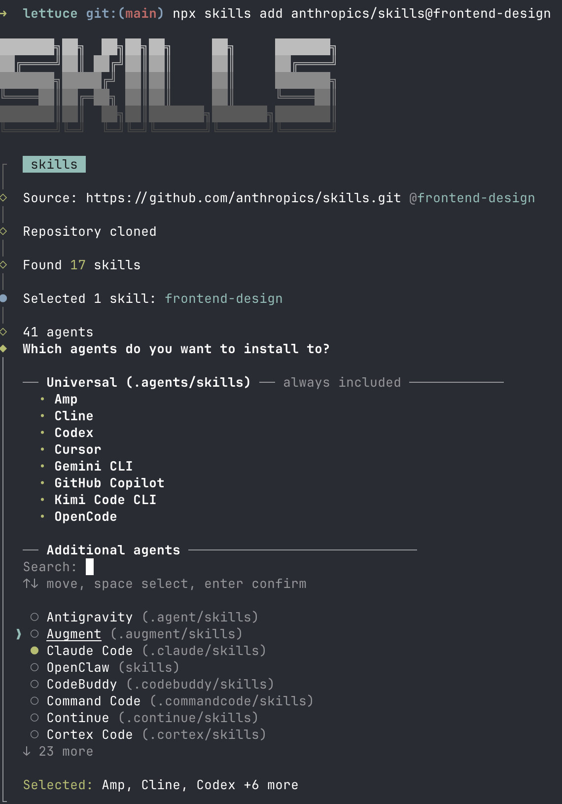

import ExternalLink from "../../../components/ExternalLink.astro";

Harness engineering is the practice of improving a coding agent's output quality and reliability by shaping the software around it, not just the prompt you type into the chat.
Instead of treating the coding agent as a black box, you shape its harness:
the instructions, tools, context, hooks, and integrations around the model, so correct behavior becomes easier and more repeatable.

In practice, that means shaping the scaffolding around the model so the right information, tools, and constraints show up at the right time.
This page walks through several common ways to do that and the tradeoffs that come with them.

## AGENTS.md

`AGENTS.md` is the lightest-weight way to steer an agent inside a repository.
It is not the only mechanism available, but it is usually the first place where
project-specific guidance belongs.

### Good and bad practices

Let's start by citing rules from <ExternalLink href="https://code.claude.com/docs/en/best-practices#write-an-effective-claude-md">Claude docs</ExternalLink>.
They are pretty good:

| ✅ Include                                            | ❌ Exclude                                          |
|:-----------------------------------------------------|:---------------------------------------------------|
| Bash commands Claude can't guess                     | Anything Claude can figure out by reading code     |
| Code style rules that differ from defaults           | Standard language conventions Claude already knows |
| Testing instructions and preferred test runners      | Detailed API documentation (link to docs instead)  |
| Repository etiquette (branch naming, PR conventions) | Information that changes frequently                |
| Architectural decisions specific to your project     | Long explanations or tutorials                     |
| Developer environment quirks (required env vars)     | File-by-file descriptions of the codebase          |
| Common gotchas or non-obvious behaviors              | Self-evident practices like “write clean code”     |

On top of that, we would add the following:

| ✅ Include                                | ❌ Exclude                                    |
|:-----------------------------------------|:---------------------------------------------|
| Only crucial and frequently needed hints | Anything that is one `ls` or `cat` call away |
| Terser language throughout the file      | Rules better handled by hooks or extensions  |

As your codebase and AGENTS.md grow, it will make sense to move chunks of that file into either skills or separate files in the `docs/` directory, while AGENTS.md becomes mostly a table of contents.

Below, you can see an example of what **NOT** to do:

````md
This is a Next.js project showcasing pet grooming practices.

# Command Reference

```bash
# Install dependencies
npm install

# Clean build artifacts
npm run clean

# Type checking
npm run typecheck

# Linting
npm run lint
```

# Structure

- `src/SCREENS.ts`: Screen name constants
- `src/ROUTES.ts`: Route definitions and builders
- `src/NAVIGATORS.ts`: Navigator configuration
````

:::tip
Don’t use the `/init` command of your harness of choice (which is meant to set up such rules files).
It tends to produce documents that bring little meaningful value.
Very often, this produces something akin to what you have just read.
:::

## Skills

<ExternalLink href="https://agentskills.io/">Agent Skills</ExternalLink> is an open standard for extending AI agents with specialized capabilities.
Skills package domain-specific knowledge and workflows that agents can use for specific tasks.

A skill is just a well-named, well-described directory containing a `SKILL.md` file with arbitrary Markdown content.
Agents initially only see all loadable skill names and descriptions, so they need to explicitly _load_ full skill definitions.
You can mention a skill explicitly, or the model may decide to do it by itself.
What goes inside a skill is up to your imagination.

### Choosing the right skills

Skills are domain-specific by nature.
We can’t tell you upfront what skills you might need without knowing what you’re working on.
Unlike other harness-specific mechanisms, skills are largely portable and can be used in many creative ways.
You may use them to save repetitive prompts, build more elaborate rules, provide hard-to-reach up-to-date documentation about your toolchain or dependencies, or define agent personalities.

### Where to find skills

#### skills.sh

The <ExternalLink href="https://skills.sh/">skills.sh</ExternalLink> directory is a good place to look for useful skills.
The accompanying `npx skills` CLI installs them in the right format for 40+
agent harnesses, including Claude Code, Cursor, Amp, Codex, Gemini CLI, GitHub
Copilot, and many more.



#### Skill repositories

Many GitHub repositories collect useful skills, similar to the _Awesome X_ lists.
Companies also publish these repositories as part of their marketing, with skills that provide guidance for their products.

For example:

- <ExternalLink href="https://github.com/anthropics/skills" />
- <ExternalLink href="https://github.com/openai/skills" />
- <ExternalLink href="https://github.com/software-mansion-labs/skills" />
- <ExternalLink href="https://github.com/topics/agent-skills" />

### Skills are forkable and your own

Skills are meant to be amended by you or your agent, so they fit your project, machine, and taste.

- Many harnesses have skills for creating new skills or updating/forking
  existing ones.
- Don’t be afraid to fork a third-party skill.
  If the “upstream” skill is updated, tell your agent to update your fork.

### Security considerations

Before you try a new skill, always read its entire source and think about its security implications.
Skills are a powerful mechanism partly because they can be insecure.

The surrounding ecosystem is still very young, and many skill-based attacks are
happening in the wild.
Be especially careful when updating third-party skills:
you never know when an upstream repository has been compromised and an attacker has inserted prompt injections.

These writeups show how this can go wrong in practice:

- <ExternalLink href="https://www.catonetworks.com/blog/cato-ctrl-weaponizing-claude-skills-with-medusalocker/" />.
  A seemingly harmless skill step in a GIF workflow was used to fetch and execute MedusaLocker ransomware.
  Even a reviewed skill can still hide second-stage execution.
- <ExternalLink href="https://embracethered.com/blog/posts/2026/scary-agent-skills/" />.
  Hidden Unicode Tag characters were used to smuggle invisible instructions into a skill.
  Visual source review alone may miss malicious behavior.

## MCP

MCP is a protocol through which AI applications can connect to data sources
(local and remote), tools (applications and services), and workflows
(like domain-specialized models).
MCP servers add tools to your agent and extend its capabilities beyond the filesystem, bash commands, and web browsing.

MCP servers can run locally (like <ExternalLink href="https://github.com/microsoft/playwright-mcp">`npx @playwright/mcp`</ExternalLink>), which lets your agent interact with your local environment.
They can also be remote HTTP-based servers, like <ExternalLink href="https://linear.app/docs/mcp">Linear MCP</ExternalLink>, that connect your agent to remote services.

### Pros and cons

One advantage of MCP over CLIs and skills is authentication:
you can connect to MCP services with API keys or OAuth through the UX provided by your harness.

The downside of MCP is that the specification requires harnesses to inject
information about all MCP tools into the system prompt.
This will sound less magical in future chapters, but in short, too many MCP servers will make your agent less capable and your harness slower to start.
Claude Code is experimenting with lazy loading MCP tools, but this is still
an unstable feature that is also not available elsewhere.

Another problem is that MCP tools are not easily composable.
Agents are trained heavily on Bash, and they are excellent with piping, awk, or jq.
They can't use these tools on MCP outputs.

:::tip
You can wrap any MCP server in a CLI via <ExternalLink href="https://github.com/steipete/mcporter/">mcporter</ExternalLink>.
For example, you can use this to wrap an MCP server into a Skill.
:::

### What MCPs might I use?

The current consensus is to use MCPs mostly for connecting to external services like Linear, Figma, Slack, or Sentry.
A good starting point for seeing which popular MCPs are available is <ExternalLink href="https://github.com/mcp" />.

Some MCPs used to be popular, but now have more efficient alternatives in the
form of CLIs or Skills.
Examples include:
- <ExternalLink href="https://github.com/github/github-mcp-server">GitHub MCP</ExternalLink> provides
  far too many tools and overloads the agent's context.
  Models have great knowledge of
  the <ExternalLink href="https://cli.github.com/">`gh` CLI</ExternalLink>
  and can do a lot with its JSON output and Bash pipelines.
- <ExternalLink href="https://context7.com/">Context7</ExternalLink> can be
  effectively replaced with domain-dedicated skills akin
  to <ExternalLink href="https://skills.sh/vercel-labs/agent-skills/vercel-react-best-practices">vercel-react-best-practices</ExternalLink>, or by documentation websites that support `Content: text/markdown` responses.

### Security considerations

MCP servers have security considerations similar to those of Skills and any
other CLI or remote service.
You are unlikely to use many MCPs, and the ones most commonly used are access
points to well-known services.
In those cases, make sure your agents will not perform destructive actions on your behalf 🙂.

## Subagents


Subagents are extra agent runs that the main agent starts to handle a narrower piece of work.
Their biggest advantage is not that they magically become a “database expert”
or a “frontend engineer”.
It is that they keep context separated.

This matters because long agent conversations degrade quickly.
Exploration notes, false starts, and verbose tool output all compete with the actual task for attention.
Offloading a bounded investigation to a subagent keeps the main thread smaller and gives you a cleaner final result.

Read more:
- <ExternalLink href="https://code.claude.com/docs/en/sub-agents" />
- <ExternalLink href="https://cursor.com/docs/subagents" />
- <ExternalLink href="https://developers.openai.com/codex/multi-agent/" />

## Hooks

Hooks are the part of the harness that runs deterministic logic around the agent.
Different tools expose them differently, but the idea is the same:
when something should happen every time, do not rely on the model to remember it.

Hooks are a better home for repetitive enforcement than `AGENTS.md`.
Formatting code, running linters, asking for approval before sensitive commands, posting notifications, or opening a pull request are all examples of work that can often be attached to a well-placed hook.

A good hook reduces prompt clutter instead of adding to it.
If the formatter succeeds, the agent usually does not need to hear about it.
If a check fails, then the failure should come back with enough detail to guide the next step.
This kind of back-pressure is useful because it keeps routine success paths out
of the model’s way while still surfacing actionable problems.
Written instructions should cover the cases that require judgment.
Hooks should cover the cases that do not.

Read more:
- <ExternalLink href="https://code.claude.com/docs/en/hooks" />
- <ExternalLink href="https://cursor.com/docs/hooks" />

## When to use what

If you are unsure which mechanism to reach for, use this rule of thumb:

| Tool      | Use it when                                                                                                        |
|:----------|:-------------------------------------------------------------------------------------------------------------------|
| AGENTS.md | You constantly repeat specific lightweight information in your prompts.                                            |
| Skills    | You need reusable, named knowledge or workflows or for anything not covered by other tools.                        |
| MCP       | You need authenticated access to an external service that you use very frequently.                                 |
| Subagents | You can delegate a bounded or parallelizable task to keep the main thread smaller.                                 |
| Hooks     | You have deterministic, mechanical logic meant to happen every time without depending on the model to remember it. |
