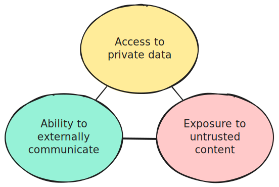
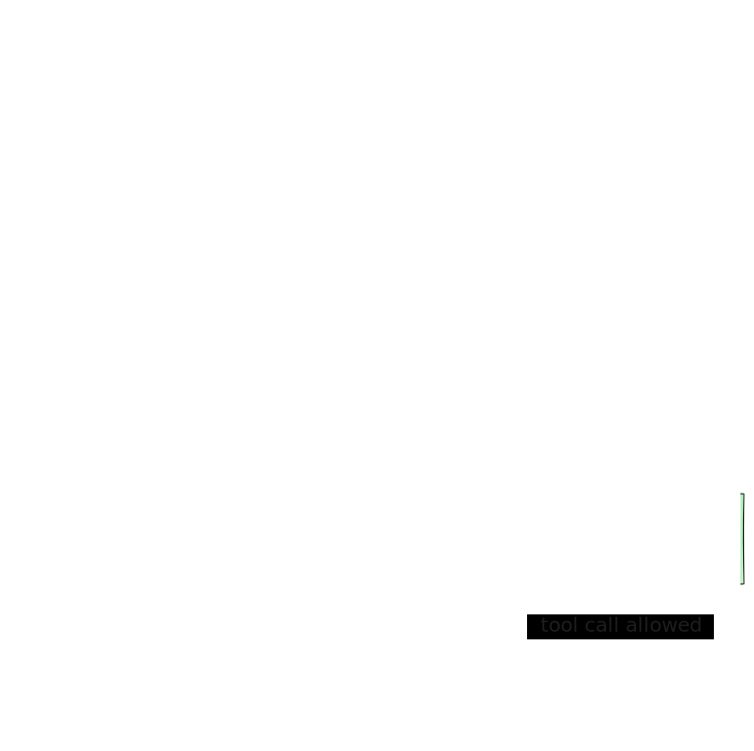

import ClapButton from "../../../components/ClapButton.astro";

import ExternalLink from "../../../components/ExternalLink.astro";

Security for coding agents is mostly about managing power, not eliminating it.
The same capabilities that make an agent useful can also let it read sensitive data, follow malicious instructions, and cause real damage when left unchecked.

This chapter introduces the main threat model behind coding agent security, shows how prompt injection failures play out in practice, and outlines the harness features that reduce the blast radius.

## The Lethal Trifecta

This term was coined by Simon Willison in <ExternalLink href="https://simonwillison.net/2025/Jun/16/the-lethal-trifecta/" />.

TL;DR: the dangerous setup is when a single agent run can do all three of these things:

Giving an agent all three capabilities at once opens it up to a wide range of attacks, allowing an attacker to steal or modify your data.
Let's see what happens when you remove one side of this triangle:

1. **Reach private data**.
   If all the data the agent can access is already public, there is nothing to steal.

   That does not mean the agent is safe, though.
   If inference costs are billed to you instead of the attacker, someone can still exploit your agent to do work for free.

   For coding agents, it is usually impossible to break this side of the triangle.
   By definition, you are asking the agent to work with some form of private data, whether that is a proprietary codebase or your local machine.

2. **Read untrusted content**.
   The attacker needs a way to get malicious input into the agent's context.
   If you carefully vet what goes into that context, you should be safe.

   This is not only about untrusted prompts.
   Anything that enters the context can be malicious: a web search result, a grepped file, an MCP tool description, or a tool call response.
   This is also why [Skills](../harness-engineering#skills) can be dangerous.
   It is very tempting to download someone else's skill blindly, and an attacker can exploit exactly that behavior.

3. **Communicate outward or take meaningful side effects**.
   Without this, the agent is effectively trapped inside a strict read-only sandbox.

   While limiting side effects is manageable, preventing outward communication is surprisingly impractical.
   Many innocent-looking actions can be turned into data exfiltration channels, including response messages, pasted beaconized links, or calls to tools that may themselves be compromised.

As you can see, coding agents are useful precisely because they satisfy the conditions of the Lethal Trifecta.
That makes coding agent security a hard problem.

The final question is: **who is the attacker?**
The surprising answer is that it is not always some evil hacker.
In this model, the attacker can also be you or your colleague.
Sometimes it is just a human doing something careless and unattended.

<ClapButton slug="becoming-productive/security/the-lethal-trifecta" />

## Cataclysms

Many interesting attacks have already happened in the wild.
We have collected a few postmortems to show how impactful and creative prompt injection attacks can be.
The failure modes differ, but the outcomes are similar: one agent run gets too much reach, and a bad action turns into a real incident.

- <ExternalLink href="https://cline.bot/blog/post-mortem-unauthorized-cline-cli-npm" />.
  An attacker-controlled issue reached an AI-powered workflow with too much authority, which then escalated into cache poisoning and a malicious package publish.
- <ExternalLink href="https://alexeyondata.substack.com/p/how-i-dropped-our-production-database" />.
  A Terraform command executed by an AI agent wiped production infrastructure, which is exactly the kind of cataclysm you get when an agent can act on real systems without enough guardrails.
- <ExternalLink href="https://invariantlabs.ai/blog/mcp-github-vulnerability" />.
  A malicious issue in a public repository coerced an agent into pulling data from private repositories and leaking it through an automatically opened public pull request.

<ClapButton slug="becoming-productive/security/cataclysms" />

## Agent Security Toolbelt

To reduce the chance of incidents like these, coding agent products usually adopt a permission-based security model.
That means every potentially dangerous action requires explicit human approval or privilege escalation.
This improves security by preserving capability at the cost of convenience, because in a secure mode you cannot leave an agent running unattended for long periods.

Consult your coding agent's documentation for the exact security features it provides, because the details vary significantly between products.
For example:

- <ExternalLink href="https://code.claude.com/docs/en/security" />
- <ExternalLink href="https://developers.openai.com/codex/agent-approvals-security" />

In broad strokes, these are the techniques that many products share:

### Permissions

Permissions are the human-in-the-loop part of the security model.
They decide **when** the agent must stop and ask before taking an action that could modify data, spend money, reach the network, or trigger some external side effect.

In practice, that usually means reads are broadly allowed, while writes, shell commands, network calls, and destructive tool invocations require approval.
Agents with permission systems may also let you approve an action once, allowlist a narrow command pattern, or switch between modes such as `read-only`, `on-request`, and `never ask again`.

Permissions are not a complete defense on their own.
They are usually based on simple pattern matching, which means effective policies often need to be broad allowlists rather than brittle blacklists.
An agent blocked from calling `curl` might still work around that restriction by writing a Python script that does the same thing.
This is why permission systems often create frustrating user experiences.

### Trusted workspaces

Some agents implement a feature similar to what Visual Studio Code or IntelliJ calls **Trusted Workspaces**.
This feature allows the agent to run inside the boundaries of a specific directory in a _safe mode_.
In that mode, the agent may refuse to load potentially malicious configuration, such as project-level settings, skills, or hook definitions.

### Sandboxing

If permissions define **when** the agent may act, sandboxing defines **what it is technically capable of doing at all**.
This is the hard boundary that constrains the agent even if the model becomes creative, confused, or outright compromised.

A good sandbox usually limits filesystem writes to the current workspace, keeps sensitive directories protected, and may also restrict process spawning or outbound network traffic.
The important distinction is that sandboxing is enforced by the runtime or operating system, not by the model politely following instructions.
This makes it much harder for the agent to find creative workarounds.
The downside is that a sandboxed agent might not integrate as well with your system, for example by being unable to inspect a browser tab.

### Limited network access

Many agent harnesses keep outbound networking disabled by default or require approval for networked tools.

Some products also default to cached web search results instead of live browsing.
This reduces exposure to prompt injection from arbitrary live content, but it does not make web content trustworthy.

This control only works when it is paired with sandboxing.
Otherwise, the model can still bypass the restriction by reaching the network through some unrestricted command such as `curl`.

### Hooks

The [Hooks](../harness-engineering/#hooks) mechanism for programming agent harness capabilities is also a powerful tool for implementing custom security mechanisms tailored to your project.

For example, you can write your own hook to block very specific Bash commands from running:

<ClapButton slug="becoming-productive/security/agent-security-toolbelt" />

## Do I need all of this?

All the security mechanisms described in the previous section can usually be turned off.
This is often called **YOLO** mode.
You can work this way if you are confident that you can trust your prompts and that your harness will not let the agent do harmful things.
Think of it like living without antivirus software two decades ago.

If you are unsure about the security of your setup, start with the default protections.
Then gradually tune them or disable the parts that are too annoying for your workflow.

<ClapButton slug="becoming-productive/security/do-i-need-all-of-this" />
