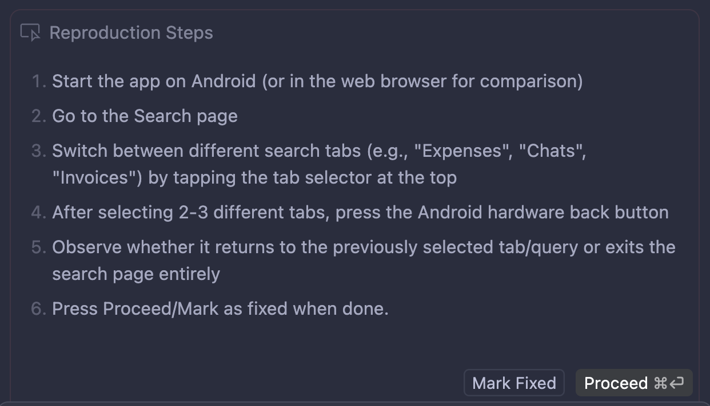

## In this chapter you will

- Set up core tools and accounts used in the workbook.
- Learn key terms used across all chapters.
- Practice first practical workflows for shipping with agents.
- Set up first self-improvement mechanisms (`AGENTS.md` and skills).

## Glossary

Before we start, let us introduce a few terms that we will use a lot:

- **Model**: A particular LLM, like Claude-4.6-Opus, GPT-5.3-Codex, Gemini-3.1-Pro.

- **Agent**: An LLM that runs tools in a loop to achieve a goal.

- **Agent Harness**: A piece of software that implements an actual agent, like Claude Code or Cursor Agent.

- **Vibe coding**: When agents write code and you're in the flow, building PoCs and MVPs, or just having fun.

- **Agentic engineering**: When you use agents to develop codebases professionally, and you are responsible for the output.

## What can AI agents even do?

- Index, understand, and navigate your codebase by themselves.
- Search the internet.
- Connect to external services (see MCP, etc.).
- Instrument and debug your code (`console.log`-style debugging).
- Prepare an implementation plan for you.
- Read and analyze screenshots, videos, and even Figma designs.
- Automatically test changes (for example, in your browser!).

## How to set up a new repo?

### Gathering knowledge

First, you will likely need to learn some things, maybe prepare a few proof-of-concepts to pre-validate your project ideas, and draft implementation plans. Chat interfaces are great for this!

:::tip
All popular chats nowadays have access to Docker sandboxes with Bash, Python, Node.js, compilers, Git, and more. They can even clone public GitHub repositories!
:::

For example, maybe you don’t know how to record system audio input/output programmatically on macOS. There is a good chance an LLM will be able to write a PoC for this! You might ask it right in the chat interface, for example:

```md
in Rust - how could I record on macos the system microphone and audio simultaneously?
I want to record voice calls that happen through my machine - like Granola does.
I don't want to register virtual audio devices etc.
From UX perspective this thing should just happen in background and have no influence
over what input/output devices does user set. write me a complete poc
```

### A first commit in 8 steps

1. Open `claude` or Cursor and switch to **Plan mode**. Tell it to scaffold a new app in your technology of choice (or, if you want fun, converse with it to pick the tech stack itself!).
2. Review the generated plan carefully. Try to pinpoint information the agent might not have known.
3. Talk to your agent. Tell it about anything you’d like to change. Tell it about something new. But don’t add new things to the scope - your job is to manage tasks you hand to the agent - they should usually be even smaller than tasks you’d hand off to a human.
4. When you are happy with the plan, switch over to Agent/Accept Edits On mode and tell your agent to do its job!
5. If you have a lot of feedback, or the agent has consumed many tokens (context usage grew significantly, e.g., less than 40% is left), you’ll probably be better off switching to a new thread.
6. The very first review message I am 101% certain you should send to your agent is this:
   ```md
   are you sure you're running the latest versions of all packages? if not, update them
   ```
7. Now it’s time to review changes. Open your editor of choice and read the generated code. You don’t have to address all review insights manually - you can tell your agent to fix many of them by itself.
8. Finally, when you are happy with the results, it’s time for the initial commit. Let’s do something fun - tell your agent to make the commit itself! This works best if you switch to the initial thread where you crafted the plan and make the commit there - the agent will use all those insights and reasoning steps from thread history to produce a much better commit message.

Here is an example conversation where the author started building a desktop app: [https://ampcode.com/threads/T-019c999d-a6a6-73db-8970-4804d16814c4](https://ampcode.com/threads/T-019c999d-a6a6-73db-8970-4804d16814c4) (used Amp for its thread-sharing feature; used a GPT model to pack more prompts into a single thread, just so it’d be easier for you to read). Notice how gibberish such a conversation can be! Prompts can be misformatted and full of typos. LLMs are very capable of ignoring this noise! Notice how much of this thread is just questions or “do whatever you want” answers.

### A first bug fixed in 7 steps

:::note
This section is Cursor-specific. Under the hood, it’s just Cursor’s magic prompting, so you can achieve the same in other harnesses by trying to replicate it.
:::

Before Debug Mode existed, the agent tried to guess the most probable root cause and immediately fix it—sometimes resulting in quick patches or even ugly workarounds 🙁

With Debug Mode, instead of guessing, the agent can form clear hypotheses, add instrumentation to collect signals, validate or reject those hypotheses, and fix the actual root cause—not just the symptoms—so let’s see it in action! 🚀 It mimics our good old `console.log` approach.

1. Open Cursor and switch to Debug mode. 
2. Explain the issue you have, send it, and give Cursor a moment. 
3. Now Cursor should form a few hypotheses (unless the root cause is clear, in which case it may implement a fix straight away).
4. Here is a fun thing: now it’ll add instrumentation to your code to verify which hypotheses are correct! Most of the time, it works by adding fetch requests to the local Cursor HTTP server, which writes everything to logs. You have to make sure Cursor has access to those logs.
   1. If you are on an Android device, remember that you need to reverse ports to allow the app to access the Cursor server: `adb reverse tcp:7242 tcp:7242`
   2. Sometimes it wants to write logs from the mobile app into your macOS directory - of course this is not possible, so you need to tell it to use a different approach.
   3. If this can’t be instrumented by writing to file/web (for example, Android native code), it might use ADB logs with custom tags - you might need to copy and paste the logs when you reproduce the issue. 

5. Now it’s your turn - it’ll ask you to reproduce the issue by giving the exact steps you need to follow. Cursor is collecting logs now. 
6. Click Proceed, and Cursor will analyze the logs. If it finds a root cause, it’ll fix it; if it needs one more round of testing, it’ll go back to point 3.
7. That’s it! It’s an easy but powerful way to address bugs in your code.

### A first design implemented in 4 steps

With the right tools, agents are excellent at turning Figma designs into rough code. If you’re building a web or mobile app, let’s try this.

1. Let’s draw a button component for your app UI. You can also prompt [Figma Make](https://www.figma.com/pl-pl/make/) to make one for you.
2. Set up [Figma MCP](https://help.figma.com/hc/en-us/articles/32132100833559-Guide-to-the-Figma-MCP-server), following these instructions: [https://help.figma.com/hc/en-us/articles/35281350665623-Figma-MCP-collection-How-to-set-up-the-Figma-remote-MCP-server](https://help.figma.com/hc/en-us/articles/35281350665623-Figma-MCP-collection-How-to-set-up-the-Figma-remote-MCP-server)
3. In Figma, copy a link to a frame or layer.
4. In your agent harness, prompt the agent to `implement this button component <url> in ui/`

That’s it! The output code will very likely be a mess because you probably haven’t established conventions in the codebase yet. Refining it through review and follow-up prompts is your job.

If you’re curious, also check out [https://www.figma.com/blog/introducing-claude-code-to-figma/](https://www.figma.com/blog/introducing-claude-code-to-figma/)

## First steps towards self-improvement

### AGENTS.md

An essential aspect of becoming productive while working with agents is to _blend them with code_. Your agents need to adapt to the codebase, and your codebase needs to adapt to the agents. For example, you might not necessarily like the commit message that the agent has just produced.

One way to steer agents toward doing the right things is to have an `AGENTS.md` file in the repository root. This file is read by the agent in each thread.

:::note
This file is standardized and supported by most agent harnesses (except Claude Code). There are also harness-specific mechanisms, like `CLAUDE.md` or [Cursor Rules](https://cursor.com/docs/context/rules).
:::

:::tip
Don’t use the `/init` command of your harness of choice (which is meant to set up such rules files). It tends to produce documents that bring little meaningful value.
:::

1. Write a minimal `AGENTS.md` file. The goal is just to steer the agent to do the right thing every time. Here is [Marek Kaput](https://github.com/mkaput)’s example template:

   ```md
   # [Project name]

   ## Rules

   - you may be running in parallel with other agents; cooperate to avoid conflicts, but avoid committing changes made by others
   - add test coverage for new logic and regression fixes where practical
   - run `npm lint` to format code and run linters; run `npm test` to run tests
   - ignore any backward compatibility - break stuff everywhere if needed

   ## Git

   - only commit what has changed in the current thread, don't commit parallel agent's work
   - if you see unexpected changes, leave them as-is
   - short, imperative commit titles (e.g., "add game server S3 bucket")
   - detailed commit descriptions telling:
   - context behind the changes: what, how and why,
   - manual testing steps,
   - special considerations.
   - if commit is meant to fix an issue, add `fix #123` at the end of the commit message.
   ```

   Here is a good template from the [agents.md](https://agents.md) website:

   ```md
   # Sample AGENTS.md file

   ## Dev environment tips

   - Use `pnpm dlx turbo run where <project_name>` to jump to a package instead of scanning with `ls`.
   - Run `pnpm install --filter <project_name>` to add the package to your workspace so Vite, ESLint, and TypeScript can see it.
   - Use `pnpm create vite@latest <project_name> -- --template react-ts` to spin up a new React + Vite package with TypeScript checks ready.
   - Check the name field inside each package's package.json to confirm the right name - skip the top-level one.

   ## Testing instructions

   - Find the CI plan in the .github/workflows folder.
   - Run `pnpm turbo run test --filter <project_name>` to run every check defined for that package.
   - From the package root you can just call `pnpm test`. The commit should pass all tests before you merge.
   - To focus on one step, add the Vitest pattern: `pnpm vitest run -t "<test name>"`.
   - Fix any test or type errors until the whole suite is green.
   - After moving files or changing imports, run `pnpm lint --filter <project_name>` to be sure ESLint and TypeScript rules still pass.
   - Add or update tests for the code you change, even if nobody asked.

   ## PR instructions

   - Title format: [<project_name>] <Title>
   - Always run `pnpm lint` and `pnpm test` before committing.
   ```

   It is rather important to keep this file relatively short but dense in crucial hints. If a piece of information is one `ls` or `cat` call away, it can be skipped.

   Below, you can see an example of what **NOT** to include.

   ````md
   message

   # Command Reference

   ```bash
   # Install dependencies
   npm install

   # Clean build artifacts
   npm run clean

   # Type checking
   npm run typecheck

   # Linting
   npm run lint
   ```

   # Structure

   - `src/SCREENS.ts`: Screen name constants
   - `src/ROUTES.ts`: Route definitions and builders
   - `src/NAVIGATORS.ts`: Navigator configuration
   ````

   You can follow these rules from [Claude docs](https://code.claude.com/docs/en/best-practices#write-an-effective-claude-md):

   | ✅ Include                                           | ❌ Exclude                                         |
   | :--------------------------------------------------- | :------------------------------------------------- |
   | Bash commands Claude can't guess                     | Anything Claude can figure out by reading code     |
   | Code style rules that differ from defaults           | Standard language conventions Claude already knows |
   | Testing instructions and preferred test runners      | Detailed API documentation (link to docs instead)  |
   | Repository etiquette (branch naming, PR conventions) | Information that changes frequently                |
   | Architectural decisions specific to your project     | Long explanations or tutorials                     |
   | Developer environment quirks (required env vars)     | File-by-file descriptions of the codebase          |
   | Common gotchas or non-obvious behaviors              | Self-evident practices like “write clean code”     |

2. Run `ln -s AGENTS.md CLAUDE.md` because Anthropic refuses to adopt someone else’s standards.
3. Both the file and symlink should be committed to the repo.

:::tip
As your codebase and AGENTS.md grow, it will make sense to move chunks of that file into either skills or separate files in the `docs/` directory, while AGENTS.md becomes mostly a table of contents.
:::

### Skills

Agent Skills is an open standard for extending AI agents with specialized capabilities. Skills package domain-specific knowledge and workflows that agents can use to perform specific tasks.

We can’t tell you upfront what skills you might need without knowing what you’re working on (because skills are domain-specific). What’s even funnier is we can’t tell you how to install skills without knowing which agent harness you are using (because the skill directory location is not standardized, though increasingly many harnesses support `.agents/skills` and `~/.agents/skills`).

:::caution
Before you try a new skill, always read its entire source and think about its security considerations. Skills are a powerful mechanism partly because they can be insecure. The surrounding ecosystem is still very young, and many skill-based attacks are happening in the wild.
:::

You can find many useful skills on [skills.sh](https://skills.sh/). They also provide an interactive CLI (`npx skills`) to pull skills from this directory into your agent harness of choice.

:::tip
Skills are meant to be amended by you or your agent to tailor to your project, machine, and taste. Don’t be afraid to fork a skill. If the “upstream” skill is updated, tell your agent to update your fork.
:::

---
