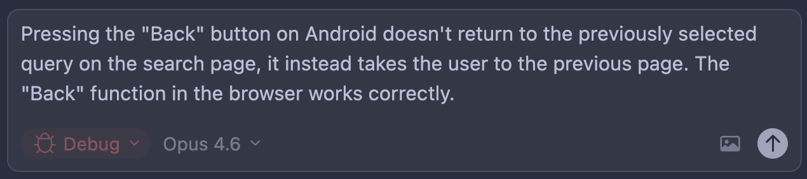
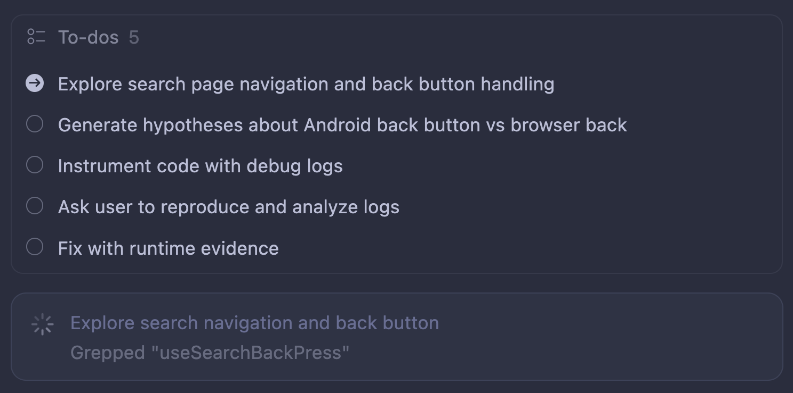
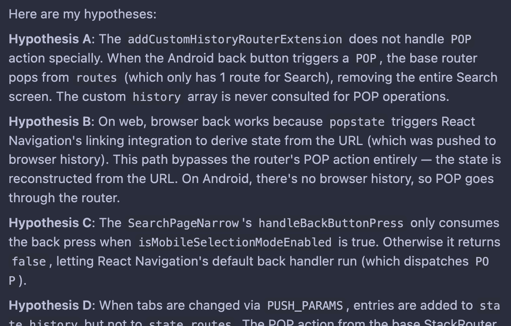

import ExternalLink from "../../../components/ExternalLink.astro";
import { Steps } from "@astrojs/starlight/components";

This practical starter path covers gathering project context, shipping a first commit, fixing a first bug, and implementing a first design with agent support.

## Gathering knowledge

First, you will likely need to learn some things, maybe prepare a few proof-of-concepts to pre-validate your project ideas, and draft implementation plans. Chat interfaces are great for this!

:::tip
All popular chats nowadays have access to Docker sandboxes with Bash, Python, Node.js, compilers, Git, and more. They can even clone public GitHub repositories!
:::

For example, maybe you don’t know how to record system audio input/output programmatically on macOS. There is a good chance an LLM will be able to write a PoC for this! You might ask it right in the chat interface, for example:

```md
in Electron - how could I record on macos the system microphone and audio
simultaneously? I want to record voice calls that happen through my machine -
like Granola does. I don't want to register virtual audio devices etc. From UX
perspective this thing should just happen in background and have no influence
over what input/output devices does user set. write me a complete poc
```

## A first commit in 8 steps

<Steps>

1. Open `claude` or Cursor and switch to **Plan mode**. Tell it to scaffold a new app in your technology of choice (or, if you want fun, converse with it to pick the tech stack itself!).
2. Review the generated plan carefully. Try to pinpoint information the agent might not have known.
3. Talk to your agent. Tell it about anything you’d like to change. Tell it about something new. But don’t add new things to the scope - your job is to manage tasks you hand to the agent - they should usually be even smaller than tasks you’d hand off to a human.
4. When you are happy with the plan, switch over to Agent/Accept Edits On mode and tell your agent to do its job!
5. If you have a lot of feedback, or the agent has consumed many tokens (context usage grew significantly, e.g., less than 40% is left), you’ll probably be better off switching to a new thread.
6. The very first review message I am 101% certain you should send to your agent is this:
   ```md
   are you sure you're running the latest versions of all packages?
   if not, update them
   ```
7. Now it’s time to review changes. Open your editor of choice and read the generated code. You don’t have to address all review insights manually - you can tell your agent to fix many of them by itself.
8. Finally, when you are happy with the results, it’s time for the initial commit. Let’s do something fun - tell your agent to make the commit itself! This works best if you switch to the initial thread where you crafted the plan and make the commit there - the agent will use all those insights and reasoning steps from thread history to produce a much better commit message.

</Steps>

Here is an <ExternalLink href="https://ampcode.com/threads/T-019c999d-a6a6-73db-8970-4804d16814c4">example conversation where the author started building a desktop app</ExternalLink> (used Amp for its thread-sharing feature; used a GPT model to pack more prompts into a single thread, just so it’d be easier for you to read). Notice how gibberish such a conversation can be! Prompts can be misformatted and full of typos. LLMs are very capable of ignoring this noise! Notice how much of this thread is just questions or “do whatever you want” answers.

## A first bug fixed in 7 steps

:::note
This section is Cursor-specific.
Under the hood, it’s just Cursor’s magic prompting, so you can achieve the same in other coding agents by trying to replicate it.
:::

Before Debug Mode existed, the agent tried to guess the most probable root cause and immediately fix it—sometimes resulting in quick patches or even ugly workarounds 🙁

With Debug Mode, instead of guessing, the agent can form clear hypotheses, add instrumentation to collect signals, validate or reject those hypotheses, and fix the actual root cause—not just the symptoms—so let’s see it in action! 🚀 It mimics our good old `console.log` approach.

<Steps>

1. Open Cursor and switch to Debug mode. 
2. Explain the issue you have, send it, and give Cursor a moment. 
3. Now Cursor should form a few hypotheses (unless the root cause is clear, in which case it may implement a fix straight away).
4. Here is a fun thing: now it’ll add instrumentation to your code to verify which hypotheses are correct! Most of the time, it works by adding fetch requests to the local Cursor HTTP server, which writes everything to logs. You have to make sure Cursor has access to those logs.
   1. If you are on an Android device, remember that you need to reverse ports to allow the app to access the Cursor server: `adb reverse tcp:7242 tcp:7242`
   2. Sometimes it wants to write logs from the mobile app into your macOS directory - of course this is not possible, so you need to tell it to use a different approach.
   3. If this can’t be instrumented by writing to file/web (for example, Android native code), it might use ADB logs with custom tags - you might need to copy and paste the logs when you reproduce the issue. 

5. Now it’s your turn - it’ll ask you to reproduce the issue by giving the exact steps you need to follow. Cursor is collecting logs now. 
6. Click Proceed, and Cursor will analyze the logs. If it finds a root cause, it’ll fix it; if it needs one more round of testing, it’ll go back to point 3.
7. That’s it! It’s an easy but powerful way to address bugs in your code.

</Steps>

## A first design implemented in 4 steps

With the right tools, agents are excellent at turning Figma designs into rough code. If you’re building a web or mobile app, let’s try this.

<Steps>

1. Let’s draw a button component for your app UI. You can also prompt <ExternalLink href="https://www.figma.com/pl-pl/make/">Figma Make</ExternalLink> to make one for you.
2. Set up Figma MCP, following these instructions:
   - <ExternalLink href="https://help.figma.com/hc/en-us/articles/32132100833559-Guide-to-the-Figma-MCP-server" />
   - <ExternalLink href="https://help.figma.com/hc/en-us/articles/35281350665623-Figma-MCP-collection-How-to-set-up-the-Figma-remote-MCP-server" />
3. In Figma, copy a link to a frame or layer.
4. In your coding agent, prompt the agent to `implement this button component [url] in ui/`

</Steps>

That’s it! The output code will very likely be a mess because you probably haven’t established conventions in the codebase yet. Refining it through review and follow-up prompts is your job.

If you’re curious, also check out:

- <ExternalLink href="https://www.figma.com/blog/introducing-claude-code-to-figma/" />
